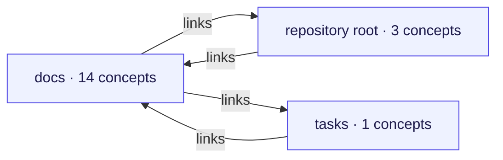
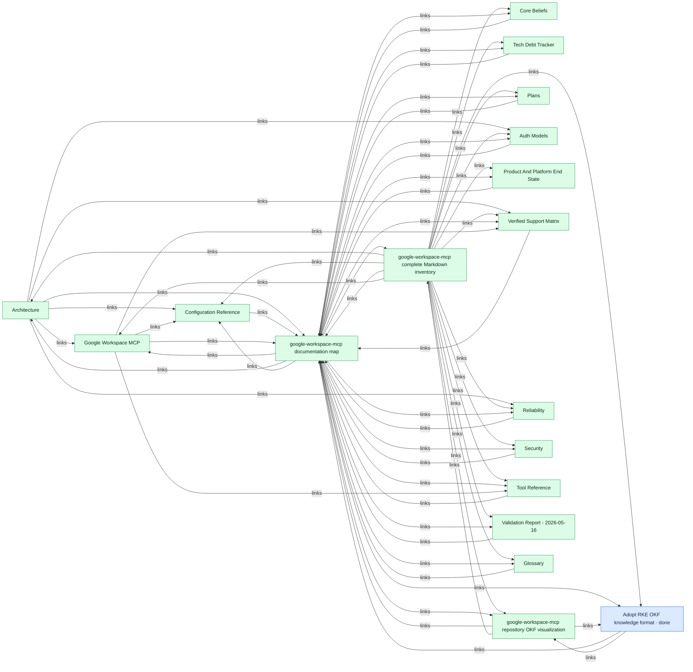
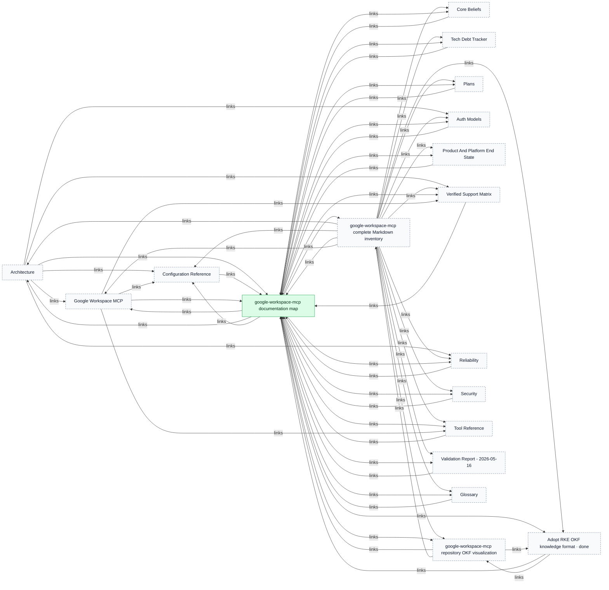
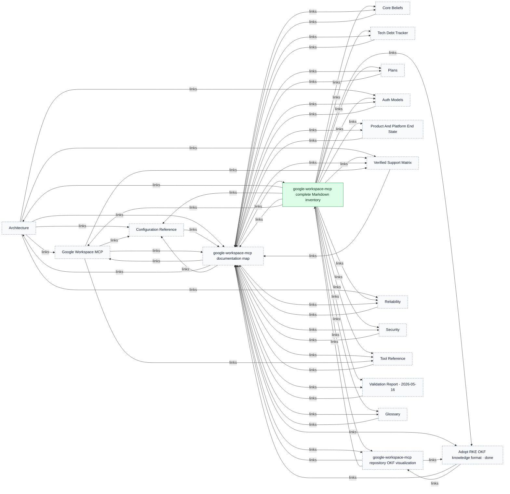
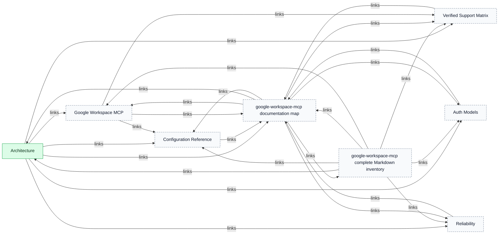
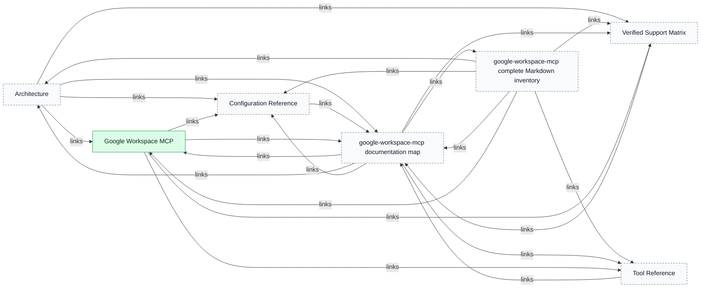
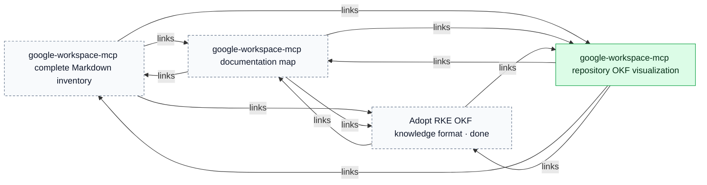
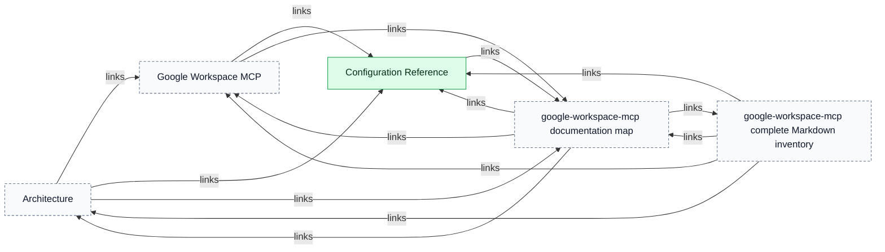

# google-workspace-mcp

> Generated from repository-local OKF records. The Markdown/YAML bundle remains canonical.

Source: `google-workspace-mcp`

The report separates the connected repository map from detailed component and key-concept views so large bundles remain reviewable.

## Connected-area overview

## Connected component 1

## Key concept neighbourhoods

### google-workspace-mcp documentation map

### google-workspace-mcp complete Markdown inventory

### Architecture

### Google Workspace MCP

### google-workspace-mcp repository OKF visualization

### Configuration Reference

## Legend

- Blue: task
- Purple: workstream
- Orange: tracker profile
- Green: durable knowledge
- Dashed neutral nodes: neighbouring context repeated from another area or key-concept view
- Time references: edges to addressable `Task.time[]` fragments
- Arrows: structured relationships or repository-local Markdown links
